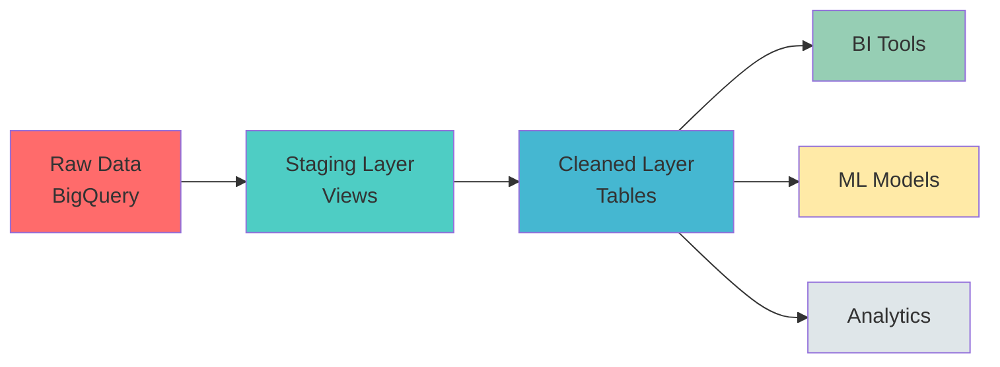

<div align="center">

# 🏥 Health Insurance Data Warehouse

### Production-Ready Data Pipeline for Health & Insurance Analytics

[](https://www.getdbt.com/)
[](https://cloud.google.com/bigquery)
[](https://www.python.org/)
[](https://github.com)

<p align="center">
  <strong>Modern ELT pipeline built with dbt and BigQuery</strong><br>
  Featuring 39+ automated tests, comprehensive data quality validation, and full documentation
</p>

[Features](#-features) • [Quick Start](#-quick-start) • [Architecture](#-architecture) • [Documentation](#-documentation) • [Tests](#-testing)

---

</div>

## 🎯 Overview

This project delivers a **production-ready data warehouse** for health and insurance analytics, implementing modern Data Engineering best practices from HWR Berlin's Data Warehouse course.

### ✨ Highlights

<table>
<tr>
<td width="50%">

**🔄 Complete ELT Pipeline**
- 4 source tables → staging → cleaned
- ~10,000+ rows transformed
- Automated quality validation
- Full data lineage tracking

</td>
<td width="50%">

**🧪 Comprehensive Testing**
- 39+ automated quality tests
- Primary key validation
- Foreign key integrity
- Range & business rule checks

</td>
</tr>
<tr>
<td width="50%">

**📊 Data Quality Engineering**
- Deduplication logic
- Multi-format date parsing
- Context-aware NULL handling
- Invalid value filtering

</td>
<td width="50%">

**📚 Full Documentation**
- Architecture diagrams
- Data lineage flows
- Troubleshooting guides
- API-style dbt docs

</td>
</tr>
</table>

---

## 🏗️ Architecture



### 📦 Data Pipeline Flow

```
┌─────────────────────────────────────────────────────────────┐
│                    RAW SOURCES (4 tables)                   │
│  • Sleep Health (374 rows)                                  │
│  • Smartwatch Data (10,001 rows)                            │
│  • Insurance Person (124 rows)                              │
│  • Insurance Facts (365 rows)                               │
└─────────────────────────────────────────────────────────────┘
                           ↓
                    STAGING LAYER (Views)
        ┌──────────────────────────────────────┐
        │  • Type casting                      │
        │  • Column rename                     │
        │  • TRIM/LOWER/UPPER                  │
        └──────────────────────────────────────┘
                           ↓
                   CLEANED LAYER (Tables)
        ┌──────────────────────────────────────┐
        │  • Deduplication                     │
        │  • Validation (39+ tests)            │
        │  • Standardization                   │
        │  • Quality flags                     │
        └──────────────────────────────────────┘
                           ↓
              ┌─────────────────────────┐
              │  CONSUMPTION LAYER      │
              │  • Dashboards           │
              │  • ML Models            │
              │  • Reports              │
              └─────────────────────────┘
```

---

## 🚀 Quick Start

### Prerequisites

```bash
# Install dbt with BigQuery adapter
pip install dbt-bigquery

# Verify installation
dbt --version
```

### Setup in 3 Steps

**1️⃣ Clone & Navigate**
```bash
git clone https://github.com/njaltran/health-insurance-data-warehouse.git
cd health-insurance-data-warehouse/dbt_health_insurance
```

**2️⃣ Configure BigQuery**

Create `~/.dbt/profiles.yml`:

```yaml
health_insurance:
  target: dev
  outputs:
    dev:
      type: bigquery
      method: oauth
      project: your-project-id  # ← Update this
      dataset: raw_dataset
      threads: 4
      location: EU
```

**3️⃣ Install & Run**

```bash
# Install dbt packages
dbt deps

# Test connection
dbt debug

# Run pipeline (creates all tables)
dbt run

# Execute quality tests
dbt test

# Generate & view documentation
dbt docs generate && dbt docs serve
```

**Expected Output:**
```
✅ 4 staging views created
✅ 4 cleaned tables created
✅ 39+ tests passed
✅ Documentation generated
```

---

## 📊 Tables & Metrics

<div align="center">

| Table | Type | Rows | Tests | Status |
|-------|------|------|-------|--------|
| `sleep_health_cleaned` | Dimension | ~320 | 11 | ✅ Production |
| `smartwatch_data_cleaned` | Facts | ~9,800 | 7 | ✅ Production |
| `health_insurance_person_cleaned` | Dimension | ~120 | 12 | ✅ Production |
| `health_insurance_facts_cleaned` | Facts | ~350 | 9 | ✅ Production |

</div>

### Key Transformations Applied

<table>
<tr>
<th>Category</th>
<th>Transformations</th>
</tr>
<tr>
<td><strong>Deduplication</strong></td>
<td>

- Full-row duplicate removal with `ROW_NUMBER()`
- Primary key deduplication (person_id, user_id)
- Composite key handling (person_id + year)

</td>
</tr>
<tr>
<td><strong>Validation</strong></td>
<td>

- Heart rate: 30-220 bpm
- Blood oxygen: 70-100%
- Age: 0-120 years
- No future dates, negative costs

</td>
</tr>
<tr>
<td><strong>Standardization</strong></td>
<td>

- Multi-format date parsing (5 formats)
- Gender normalization (male, female, other, unknown)
- Text cleaning (TRIM, LOWER, UPPER)
- Blood pressure parsing ("131/86" → systolic/diastolic)

</td>
</tr>
<tr>
<td><strong>NULL Handling</strong></td>
<td>

- Dimensions: `COALESCE(value, 'unknown')`
- Metrics: `COALESCE(value, 0)`
- Quality flags: `is_missing_*`

</td>
</tr>
</table>

---

## 🧪 Testing

### Test Coverage (39+ Automated Tests)

```bash
# Run all tests
dbt test

# Test specific model
dbt test --select sleep_health_cleaned

# Test by type
dbt test --select test_type:unique
dbt test --select test_type:relationships
```

**Test Categories:**

| Category | Count | Examples |
|----------|-------|----------|
| **Uniqueness** | 8 | Primary keys, composite keys |
| **Not Null** | 12 | Critical fields validation |
| **Accepted Values** | 9 | Gender, status codes, categories |
| **Relationships** | 2 | Foreign key integrity |
| **Range Validation** | 8 | Age, heart rate, dates, costs |

### Example Test Output

```
12:45:23  Running with dbt=1.7.4
12:45:25  Found 8 models, 39 tests, 0 snapshots
12:45:27
12:45:27  Completed successfully
12:45:27
12:45:27  Done. PASS=39 WARN=0 ERROR=0 SKIP=0 TOTAL=39
```

---

## 📈 Data Quality Improvements

<div align="center">

### Before vs After

| Issue | Raw Data | Cleaned Data |
|-------|----------|--------------|
| Duplicates | ❌ Present | ✅ Removed |
| Date Formats | ❌ 5 Different | ✅ Standardized DATE |
| Gender Values | ❌ m, f, male, MALE | ✅ male, female, other, unknown |
| NULL Strategy | ❌ No Handling | ✅ Context-aware COALESCE |
| Invalid Values | ❌ Heart rate=0 | ✅ Filtered with flags |
| Type Safety | ❌ All STRING | ✅ INT64, FLOAT64, DATE |
| Blood Pressure | ❌ Text "131/86" | ✅ Parsed (systolic/diastolic) |

</div>

---

## 🔧 Data Engineering Standards

This project implements **industry best practices** from HWR Berlin Expert Dossiers:

<details>
<summary><strong>🏛️ Expert Dossier 1: Modern Data Architecture</strong></summary>

- ✅ ELT pattern (Extract-Load-Transform)
- ✅ Schema-on-Read philosophy
- ✅ Cloud data warehouse optimization (BigQuery)
- ✅ Layered architecture (staging → cleaned → consumption)

</details>

<details>
<summary><strong>📊 Expert Dossier 2: Data Quality & Metadata</strong></summary>

- ✅ 6 dimensions of data quality (Accuracy, Completeness, Consistency, Timeliness, Uniqueness, Validity)
- ✅ Data profiling approach
- ✅ Metadata management (schema.yml)
- ✅ Data lineage tracking (dbt DAG)

</details>

<details>
<summary><strong>🔄 Expert Dossier 3: Transformation Logic</strong></summary>

- ✅ Deduplication patterns (ROW_NUMBER)
- ✅ Type enforcement and sanitization
- ✅ Temporal standardization
- ✅ Reference data mapping
- ✅ NULL handling strategies

</details>

<details>
<summary><strong>📥 Expert Dossier 4: Loading Strategies</strong></summary>

- ✅ Merge/Upsert patterns
- ✅ Surrogate key architecture
- ✅ Data quality gates (circuit breakers)
- ✅ Quarantine approach (quality flags)

</details>

---

## 📁 Project Structure

```
health-insurance-data-warehouse/
│
├── 📂 dbt_health_insurance/          # Main dbt project
│   │
│   ├── 📂 models/
│   │   ├── 📂 staging/               # Staging layer (4 views)
│   │   │   ├── stg_sleep_health.sql
│   │   │   ├── stg_smartwatch_data.sql
│   │   │   ├── stg_health_insurance_person.sql
│   │   │   ├── stg_health_insurance_facts.sql
│   │   │   └── sources.yml           # Source definitions
│   │   │
│   │   └── 📂 cleaned/               # Cleaned layer (4 tables)
│   │       ├── sleep_health_cleaned.sql
│   │       ├── smartwatch_data_cleaned.sql
│   │       ├── health_insurance_person_cleaned.sql
│   │       ├── health_insurance_facts_cleaned.sql
│   │       └── schema.yml            # 39+ tests
│   │
│   ├── 📂 macros/                    # Custom SQL macros
│   │   └── test_helpers.sql
│   │
│   ├── 📂 analyses/                  # Data quality reports
│   │   └── data_quality_summary.sql
│   │
│   ├── 📄 dbt_project.yml            # Project config
│   ├── 📄 packages.yml               # dbt-utils dependency
│   │
│   └── 📚 Documentation
│       ├── README.md                 # dbt project docs
│       ├── QUICKSTART.md             # 5-minute setup
│       ├── DATA_LINEAGE.md           # Lineage diagrams
│       └── TROUBLESHOOTING.md        # Common issues
│
├── 📂 context/                       # Expert dossiers (reference)
│
├── 📄 data_cleaning_scripts.sql      # Original SQL (pre-dbt)
├── 📄 PROJECT_SUMMARY.md             # Comprehensive overview
├── 📄 GITHUB_SETUP.md                # GitHub push guide
├── 📄 GIT_SUMMARY.md                 # Git setup verification
└── 📄 README.md                      # This file
```

---

## 📚 Documentation

<table>
<tr>
<td width="50%">

### 📖 User Guides
- [Quick Start Guide](dbt_health_insurance/QUICKSTART.md) - Get started in 5 minutes
- [Troubleshooting](dbt_health_insurance/TROUBLESHOOTING.md) - Common issues & solutions
- [GitHub Setup](GITHUB_SETUP.md) - Repository setup guide

</td>
<td width="50%">

### 🔍 Technical Docs
- [Data Lineage](dbt_health_insurance/DATA_LINEAGE.md) - Visual flow diagrams
- [Project Summary](PROJECT_SUMMARY.md) - Complete overview
- [dbt Docs](http://localhost:8080) - Auto-generated (run `dbt docs serve`)

</td>
</tr>
</table>

---

## 🎯 Output Location

After running `dbt run`, cleaned data is available at:

```
📍 BigQuery Location:
   Project: dw-health-insurance-bipm
   └── Dataset: raw_dataset
       └── Schema: cleaned
           ├── sleep_health_cleaned
           ├── smartwatch_data_cleaned
           ├── health_insurance_person_cleaned
           └── health_insurance_facts_cleaned
```

**Query Example:**
```sql
-- Query cleaned sleep health data
SELECT *
FROM `dw-health-insurance-bipm.raw_dataset.cleaned.sleep_health_cleaned`
WHERE is_invalid_heart_rate = FALSE
LIMIT 100;

-- Check data quality flags
SELECT
  COUNT(*) as total_rows,
  SUM(CAST(is_missing_stress_level AS INT64)) as missing_stress,
  SUM(CAST(is_invalid_heart_rate AS INT64)) as invalid_hr
FROM `dw-health-insurance-bipm.raw_dataset.cleaned.smartwatch_data_cleaned`;
```

---

## 🔗 Data Lineage

View the complete data flow and dependencies:

```bash
# Generate interactive lineage graph
dbt docs generate
dbt docs serve

# Navigate to "Lineage" tab in browser
# URL: http://localhost:8080
```

**Lineage Highlights:**
- 🔵 Source tables (raw data)
- 🟢 Staging models (views)
- 🟡 Cleaned models (tables)
- 🔴 Test coverage (39+ tests)
- ⚡ Dependency graph (DAG)

Or view static lineage diagrams in [DATA_LINEAGE.md](dbt_health_insurance/DATA_LINEAGE.md).

---

## 🤝 Contributing

This is an academic project for **HWR Berlin's Data Warehouse course**. Contributions welcome!

### How to Contribute

1. 🍴 Fork the repository
2. 🌿 Create feature branch: `git checkout -b feature/amazing-feature`
3. ✅ Commit changes: `git commit -m 'Add amazing feature'`
4. 📤 Push to branch: `git push origin feature/amazing-feature`
5. 🔄 Open Pull Request

### Development Standards

- Follow dbt best practices
- Add tests for new models
- Update documentation
- Ensure `dbt test` passes

---

## 📖 References & Resources

### Course Materials
- **Expert Dossier 1:** Modern Data Architecture & Data Serving
- **Expert Dossier 2:** Extraction Strategies & CDC
- **Expert Dossier 3:** Transformation Logic & Data Quality Engineering
- **Expert Dossier 4:** Loading Strategies & History Management

### External Resources
- [dbt Documentation](https://docs.getdbt.com/) - Official dbt docs
- [BigQuery Best Practices](https://cloud.google.com/bigquery/docs/best-practices) - Google Cloud guide
- [Data Quality Dimensions](https://www.montecarlodata.com/blog-6-data-quality-dimensions-examples/) - Quality framework

---

## 🎓 Academic Context

<table>
<tr>
<td width="60%">

**Course:** Data Warehouse (HWR Berlin)<br>
**Semester:** Winter 2025/2026<br>
**Professor:** Prof. Dr. Sebastian Fischer<br>
**Topic:** Modern Data Engineering with dbt and BigQuery

</td>
<td width="40%">

**Learning Objectives:**
- ✅ ELT architecture
- ✅ Data quality engineering
- ✅ Automated testing
- ✅ Production-ready code

</td>
</tr>
</table>

---

## 👤 Author

<div align="center">

**Nikolas Jackaltran**

🏛️ HWR Berlin | 📅 January 2026

[GitHub](https://github.com/njaltran) • [LinkedIn](https://linkedin.com)

</div>

---

## 🙏 Acknowledgments

Special thanks to:

- **Prof. Dr. Sebastian Fischer** - Course instructor and expert dossiers
- **dbt Labs** - For the amazing dbt framework
- **Google Cloud** - For BigQuery platform
- **HWR Berlin** - For world-class Data Engineering education

---

## 📄 License

This project is for **educational purposes** as part of HWR Berlin's Data Warehouse course.

Feel free to use as a reference for learning modern data engineering practices.

---

<div align="center">

### 🌟 Star this repo if you found it helpful!

**Built with ❤️ following Modern Data Engineering Best Practices**

[](https://www.getdbt.com/)
[](https://cloud.google.com/bigquery)

---

**Questions?** Check the [Troubleshooting Guide](dbt_health_insurance/TROUBLESHOOTING.md) or open an issue.

</div>
